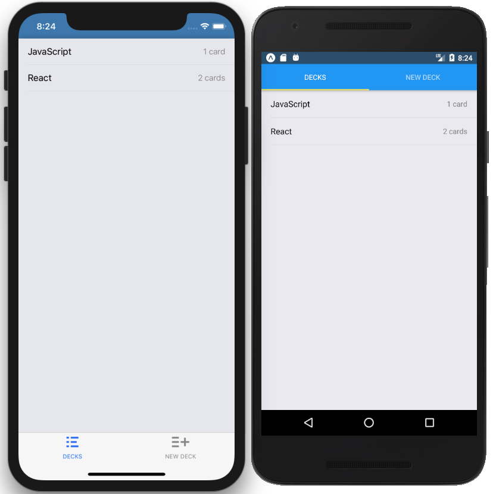
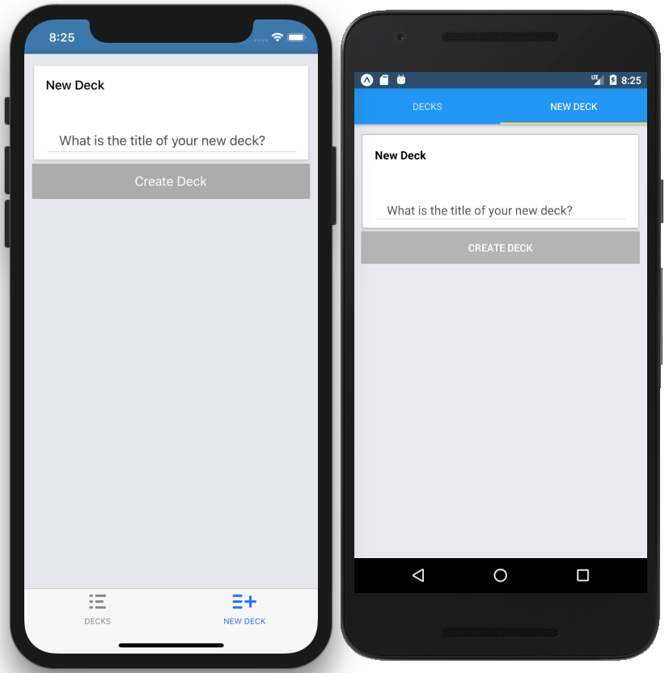
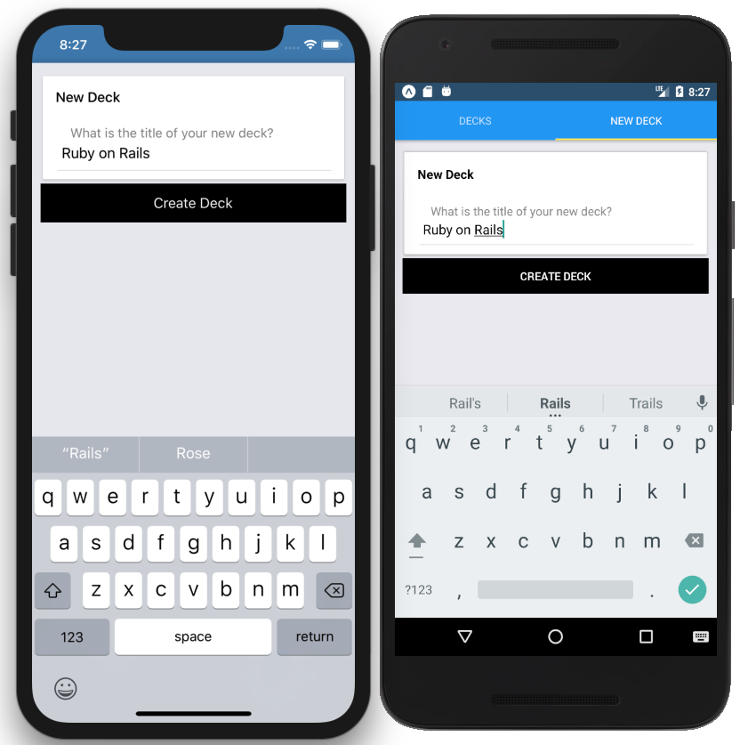
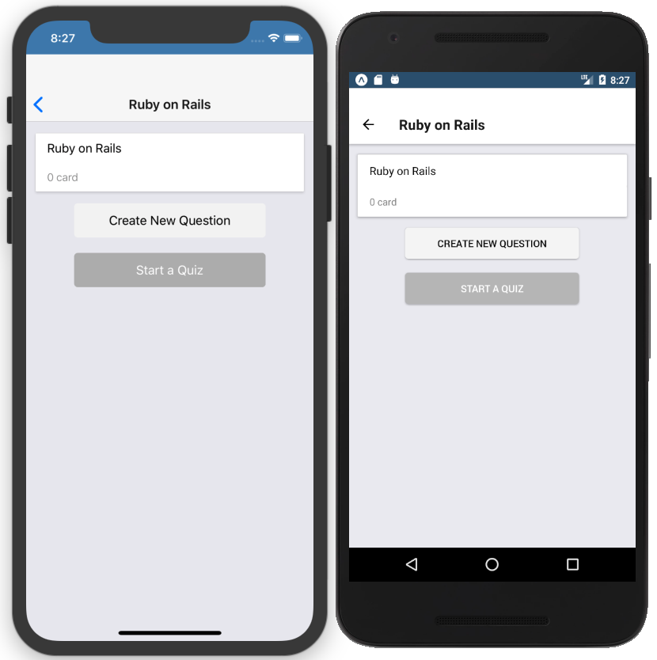
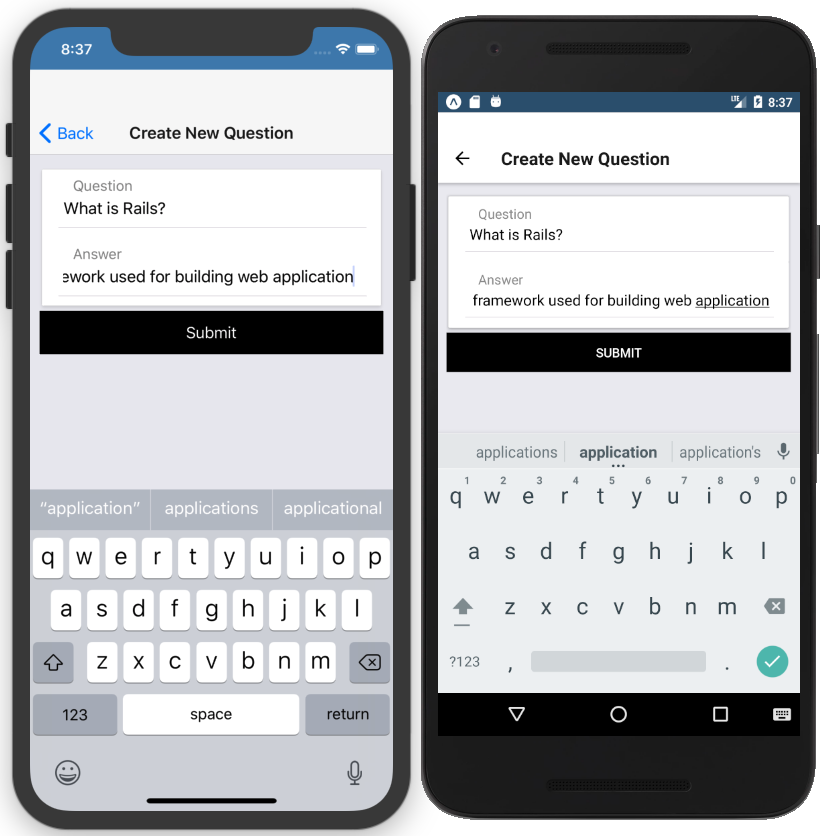
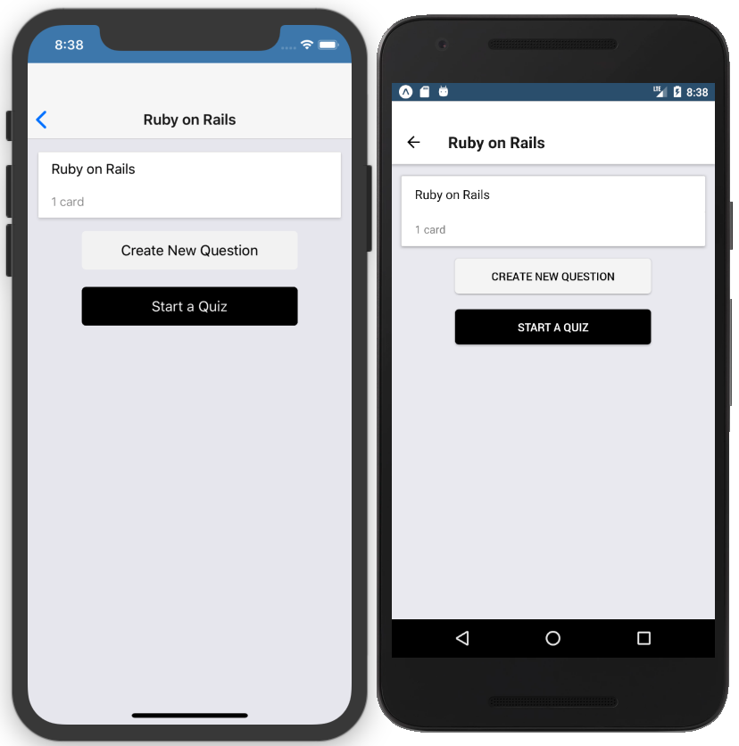
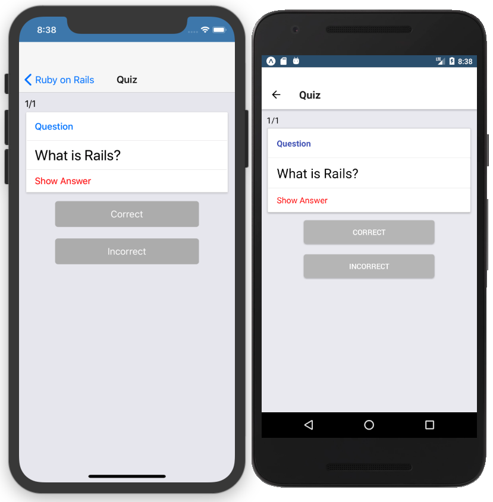
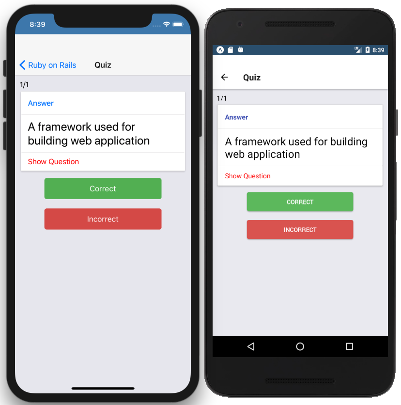
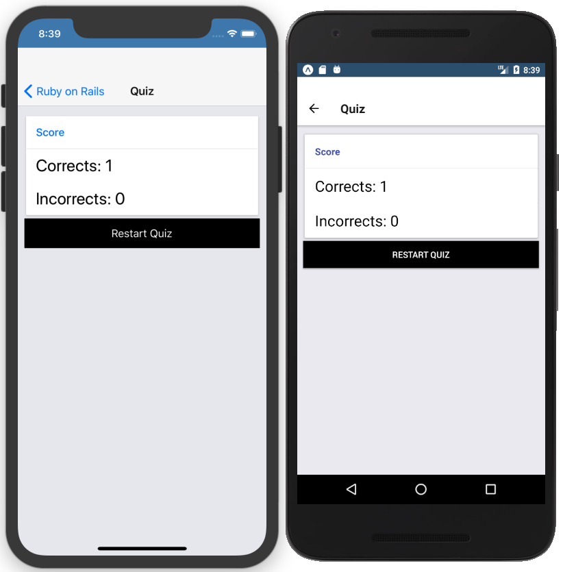

# Mobile Flashcards

Mobile Flashcards App to test your knowledge.

Using React Native and compatible with iOS and Android.

## Setup

Open a terminal:

````
yarn install
yarn start
````

## Screenshots










